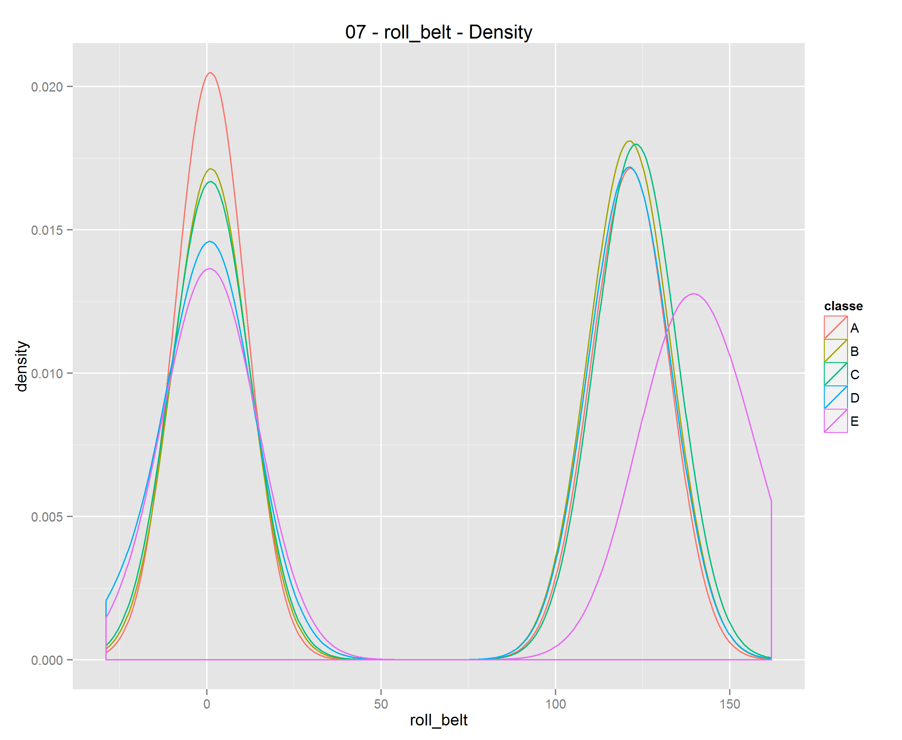
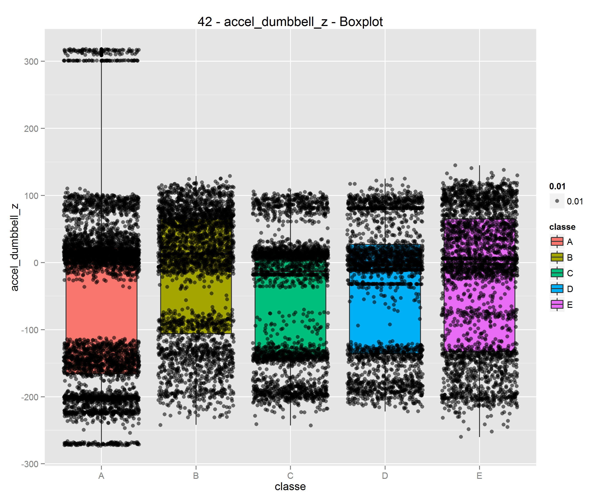

```{r, echo=FALSE, cache=TRUE}
setwd("C:/Users/jjensen/Dropbox/R/Coursera - Data Science Certificate/8 - Practical Machine Learning/project")


######################
##
## Practical Machine Learning
## Predicion Assignment
## Author: Joshua Jensen
##
## Objective: Predict  ('classe' variable) from FitBit sensor data
##
######################
```
# Practical Machine Learning Predicion Assignment
### Using Wearable Sensor Data to Predict Common Mistakes in Dumbbell Bicep Curls
### Author: Josh Jensen
Coursera / Johns Hopkins
Practical Machine Learning

### I. Synopsis
Using wearable sensor data, I predict common mistakes in dumbbell bicep curls using a random forest model. Individuals were asked to perform a series of exercises while wearing sensors. According to the research team, the exercises were as follows:
"exactly according to the specification (Class A), throwing the elbows to the front (Class B), lifting the dumbbell only halfway (Class C), lowering the dumbbell only halfway (Class D) and throwing the hips to the front (Class E)."

The model I build predicts this classification of A through E, looking only at the sensor data.

Read more: http://groupware.les.inf.puc-rio.br/har#dataset#ixzz3mzKZ0t8Q

All credit for the original study and collection of the source data comes from the following:
http://groupware.les.inf.puc-rio.br/har
Ugulino, W.; Cardador, D.; Vega, K.; Velloso, E.; Milidiu, R.; Fuks, H. Wearable Computing: Accelerometers' Data Classification of Body Postures and Movements. Proceedings of 21st Brazilian Symposium on Artificial Intelligence. Advances in Artificial Intelligence - SBIA 2012. In: Lecture Notes in Computer Science. , pp. 52-61. Curitiba, PR: Springer Berlin / Heidelberg, 2012. ISBN 978-3-642-34458-9. DOI: 10.1007/978-3-642-34459-6_6. 

### II. Data Processing

First I load the training and evaluation training data from csv files using readr.

```{r, cache=TRUE}
library(dplyr)
library(ggplot2)
library(readr)
library(caret)

set.seed(221)

df <- read_csv("pml-training.csv")
eval_test <- read_csv("pml-testing.csv")
```

Now I filter down to only applicable measures for the assignment (ie. the vairables that are present in both pml-training.csv & pml-testing.csv). This is to ensure the model is not reliant on data that one should not expect to ultimately pass to it.

To do this I peek at the evaluation test set and determine which columns are only comprised of NA's.
```{r, cache=TRUE}
# seed with the "[EMPTY]" column name
invalid_columns <- "[EMPTY]"
for (i in 1:length(colnames(eval_test))) {
  if(sum(is.na(eval_test[,i]))==nrow(eval_test)){
    temp <- colnames(eval_test)[i]
    
    invalid_columns <- c(invalid_columns,temp)
  }
}

df <- select(df, -one_of(invalid_columns))
eval_test <- select(eval_test, -one_of(invalid_columns))
```

Now I partition the data into training and test sets. Since I will be using random forests, I will establish use a slightly larger training set to ensure a better fit within the bootstraping involved with the random forest algorithm.
```{r, cache=TRUE}
in_train <- createDataPartition(y=df$classe,
                               p=0.7, 
                               list=FALSE)
training <- df[in_train,]
testing <- df[-in_train,]
```

### III. Exploratory Analysis / Plotting the Predictors

First I inspect the present variable types using:
```{r, eval=FALSE}
lapply(training, class)
```

Critically, from this it appears that $classe$ is a $"character"$ type and not a $"factor"$ type. This will need to be changed prior to running a model against this variable. 

Next to make exploratory analysis easier, I will print a density plot and boxplot for every metric. Using the following $for$ loop we can acheive this. The loop runs over all columns in the training set. It first checks if the column data type is $"integer"$ or $"numeric"$. If so, it then creates, prints, and saves a ggplot density plot and a ggplot boxplot.

```{r, eval=FALSE}
# density plots & box plots for all variables
for(i in 1:ncol(training)){
  if( lapply(training, class)[[i]] %in% c("integer","numeric")){
    # create density ggplot
    temp_plot <- ggplot(training, aes_string(x= colnames(training)[i], colour = "classe")) + 
      geom_density() +
      ggtitle(paste(sprintf("%02d",i), "-", colnames(training)[i], "- Density"))
    
    print(temp_plot)
    ggsave(temp_plot, filename = paste0("./plots/", sprintf("%02d",i), "_", colnames(training)[i], "_density.png"))
    
    # create boxplot ggplot
    temp_plot <- ggplot(training, aes_string(x = "classe", y = colnames(training)[i])) + 
      geom_boxplot(aes(fill = classe)) + 
      geom_jitter(aes(alpha = .01)) +
      ggtitle(paste(sprintf("%02d",i), "-", colnames(training)[i], "- Boxplot"))
    
    print(temp_plot)
    ggsave(temp_plot, filename = paste0("./plots/", sprintf("%02d",i), "_", colnames(training)[i], "_box.png"))
  }
}
```

Once this is done, I then can rapidly examine each plot for any patterns either within RStudio or in an image viewer. Below are 2 examples of the output. The rest can be viewed in the $/plots$ folder.






### IV. Final Data Transformations

Since I will be using a random forest algorithm, any monotonic scaling or transformation will have little effect on the model. So for the purposes of this project I will ignore rescaling for outliers. 

However, through the exploratory analysis it has become clear that the set of columns defining the timestamp of the data collection is irrelevant and would also be inappropriate to use in the model. This is because the goal of the project is to predict the classification of the exercise based off of the sensor data alone. Below I remove the irrelevant columns.
```{r, cache=TRUE}
irrelevant_columns <- c("user_name","raw_timestamp_part_1","raw_timestamp_part_2","cvtd_timestamp","new_window","num_window" )
training <- select(training, -one_of(irrelevant_columns))
```

Now I ensure that $classe$ is a $factor$ data type.
```{r, eval=FALSE}
training$classe <- as.factor(training$classe)
```


### V. Train and test the model

Now we run the random forest model, using caret's $train$ function.
```{r, eval=FALSE}
model_fit_rf <- train(classe ~ .,
                   data = training,
                   method = "rf",
                   prox = TRUE)
### WARNING: this takes a very long time to process
```

Lets evaluate against the test set using the $confusionMatrix$ function.
```{r, eval=FALSE}
confusionMatrix(testing$classe, predict(model_fit_rf, newdata = testing))
```

The model has achieved a 99.4% accuracy against the test set! This may be a bit overstated due to overfitting, but as of now this can be treated as an operating model.

Finally, we get to predict against the evaluation test data.
```{r, eval=FALSE}
predict(model_fit_rf, newdata = eval_test)
```
